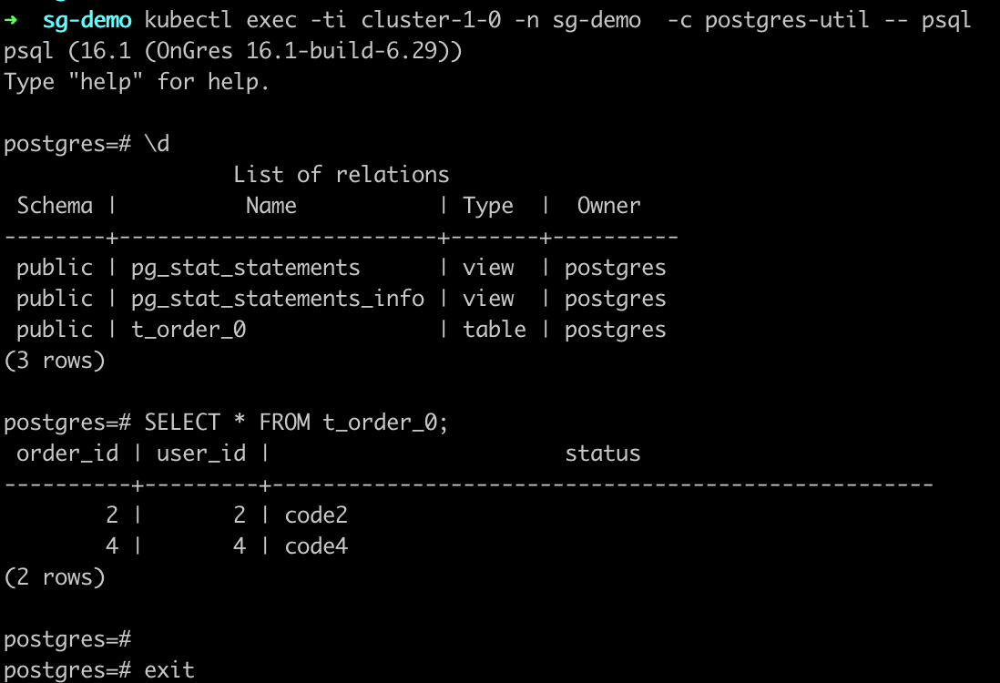
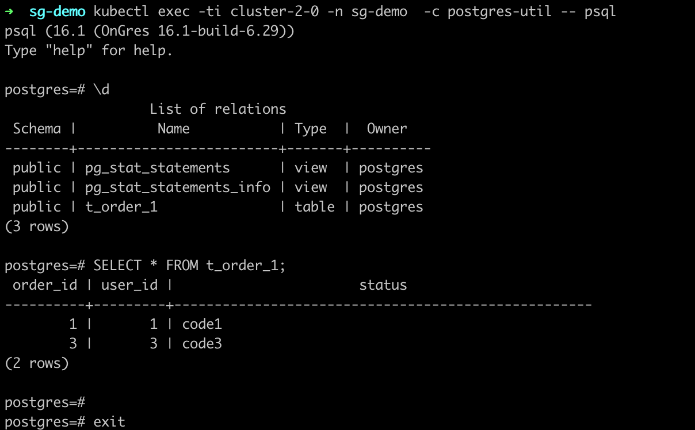

# Solutions for StackGres

## Demo

1. 创建 namespace
kubectl create namespace sg-demo
2. 使用 Helm 安装 StackGres

```shell
# 添加 StackGres Helm 仓库
helm repo add stackgres-charts https://stackgres.io/downloads/stackgres-k8s/stackgres/helm/

# 安装 operator
helm install --namespace sg-demo stackgres-operator stackgres-charts/stackgres-operator
```


3. 创建两个最简化 SGCluster：
```shell
cat << 'EOF' | kubectl create -f -
apiVersion: stackgres.io/v1
kind: SGCluster
metadata:
  name: cluster-1
  namespace: sg-demo
spec:
  instances: 1
  postgres:
    version: 'latest'
  pods:
    persistentVolume: 
      size: '5Gi'
EOF

cat << 'EOF' | kubectl create -f -
apiVersion: stackgres.io/v1
kind: SGCluster
metadata:
  name: cluster-2
  namespace: sg-demo
spec:
  instances: 1
  postgres:
    version: 'latest'
  pods:
    persistentVolume: 
      size: '5Gi'
EOF
```


4. 通过查看 Secret 获取两个 PG 集群的访问用户名和密码
```shell
# 查看 cluster-1 的用户名和密码 postgres / 5bc0-07f8-40b3-b81
kubectl get secret cluster-1 -n sg-demo -o jsonpath="{.data.superuser-username}" | base64 -d
kubectl get secret cluster-1 -n sg-demo -o jsonpath="{.data.superuser-password}" | base64 -d

# 查看 cluster-2 的用户名和密码 postgres / 700e-33b3-4edf-bde
kubectl get secret cluster-2 -n sg-demo -o jsonpath="{.data.superuser-username}" | base64 -d
kubectl get secret cluster-2 -n sg-demo -o jsonpath="{.data.superuser-password}" | base64 -d
```


5. 部署 ShardingSphere Operator 
```
# 添加 Apache ShardingSphere Helm 仓库
helm repo add shardingsphere https://apache.github.io/shardingsphere-on-cloud

# 安装 Apache ShardingSphere Operator
helm install shardingsphere-operator shardingsphere/apache-shardingsphere-operator-charts -n sg-demo --set zookeeper.persistence.enabled=false --set operator.featureGates.computeNode=true --set proxyCluster.enabled=false
```


6. 创建计算节点并拉起 Proxy
```shell
cat << EOF | kubectl create -f -
apiVersion: shardingsphere.apache.org/v1alpha1
kind: ComputeNode
metadata:
  annotations:
    shardingsphere.apache.org/java-agent-enabled: "true"
    prometheus.io/path: "/metrics"
    prometheus.io/scrape: "true"
    prometheus.io/port: "9090"
  labels:
    app: shardingsphere-proxy
  name: shardingsphere-proxy
  namespace: sg-demo
spec:
  serverVersion: 5.4.1
  replicas: 1
  selector:
    matchLabels:
      app: shardingsphere-proxy
  portBindings:
  - name: server
    containerPort: 5432
    servicePort: 5432
    protocol: TCP
  serviceType: ClusterIP
  bootstrap:
    serverConfig:
      authority:
        privilege:
          type: ALL_PERMITTED
        users:
        - user: root@%
          password: root
      mode:
        type: Cluster
        repository:
          type: ZooKeeper
          props:
            timeToLiveSeconds: "600"
            server-lists: shardingsphere-operator-zookeeper.sg-demo:2181
            retryIntervalMilliseconds: "500"
            operationTimeoutMilliseconds: "5000"
            namespace: governance_ds
            maxRetries: "3"
      props:
        proxy-frontend-database-protocol-type: PostgreSQL
        proxy-default-port: "5432"
    agentConfig:
      plugins:
        logging:
          file:
            props:
              level: "INFO"
        metrics:
          prometheus:
            host: "0.0.0.0"
            port: 9090
            props:
              jvm-information-collector-enabled: "true"
EOF
```


7. 手动登录 Proxy，注册数据源，配置分片规则
```shell
# 通过 kubectl port-forward 暴露 ShardingSphere Proxy 端口到本地进行访问
 kubectl port-forward svc/shardingsphere-proxy  -n sg-demo 5432:5432

# 通过 psql 连接
psql -h 127.0.0.1 -p 5432 postgres root

# 创建逻辑库 sharding_db
postgres=> CREATE DATABASE sharding_db;

# 切换到该逻辑库
\c sharding_db;

# 注册数据源
REGISTER STORAGE UNIT ds_0 (HOST="cluster-1.sg-demo", PORT=5432, DB="postgres", USER="postgres", PASSWORD="5bc0-07f8-40b3-b81"),ds_1(HOST="cluster-2.sg-demo", PORT=5432, DB="postgres", USER="postgres", PASSWORD="700e-33b3-4edf-bde");

# 配置分片规则
CREATE SHARDING TABLE RULE t_order(STORAGE_UNITS(ds_0,ds_1),SHARDING_COLUMN=order_id,TYPE(NAME="hash_mod",PROPERTIES("sharding-count"="2")),KEY_GENERATE_STRATEGY(COLUMN=order_id,TYPE(NAME="snowflake"))); 

# 创建表
 CREATE TABLE t_order (
   order_id INT PRIMARY KEY  NOT NULL,
   user_id  INT    NOT NULL,
   status        CHAR(50)
);
```


8. Proxy 插入数据以及查看
```shell
# 插入数据
INSERT INTO t_order(order_id, user_id, status) VALUES(1, 1, 'code1'),(2, 2, 'code2'),(3, 3, 'code3'),(4, 4, 'code4');

# 查看数据
```


9. 每个 SGCluster 检查数据
```shell
# 访问 SGCluster 自带的 psql 工具
kubectl exec -ti cluster-1-0 -n sg-demo  -c postgres-util -- psql

# 查看机器 cluster-1 的表结构
\d

# 查询集群 cluster-1 里的数据
SELECT * FROM t_order_0;
```



```shell
# 访问 SGCluster 自带的 psql 工具
kubectl exec -ti cluster-2-0 -n sg-demo  -c postgres-util -- psql

# 查看机器 cluster-2 的表结构
\d

# 查询集群 cluster-2 里的数据
SELECT * FROM t_order_1;
```


